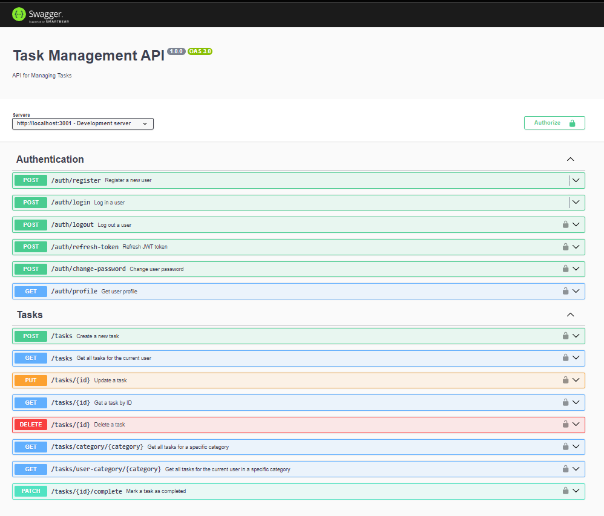

# Task Management Application - Backend Documentation

## Table of Contents

1. [Introduction](#1-introduction)
2. [Architecture Overview](#2-architecture-overview)
   - 2.1 [Clean Architecture Approach](#21-clean-architecture-approach)
   - 2.2 [Design Practices](#22-design-practices)
3. [Technology Stack](#3-technology-stack)
4. [Project Structure](#4-project-structure)
5. [Core Components](#5-core-components)
   - 5.1 [Domain Layer](#51-domain-layer)
   - 5.2 [Application Layer](#52-application-layer)
   - 5.3 [Infrastructure Layer](#53-infrastructure-layer)
   - 5.4 [Interface Layer](#54-interface-layer)
6. [Database Design](#6-database-design)
7. [API Design](#7-api-design)
   - 7.1 [RESTful Endpoints](#71-restful-endpoints)
   - 7.2 [Swagger Documentation](#72-swagger-documentation)
8. [Authentication and Authorization](#8-authentication-and-authorization)
9. [Error Handling and Logging](#9-error-handling-and-logging)
10. [Testing Strategy](#10-testing-strategy)
11. [Code Quality and Documentation](#11-code-quality-and-documentation)
    - 11.1 [Coding Standards](#111-coding-standards)
    - 11.2 [Comprehensive Docstrings](#112-comprehensive-docstrings)
12. [Deployment](#12-deployment)
13. [Performance Considerations](#13-performance-considerations)
14. [Security Measures](#14-security-measures)
15. [Scalability Approach](#15-scalability-approach)
16. [Setup and Installation](#16-setup-and-installation)
17. [Conclusion](#17-conclusion)

## 1. Introduction

This documentation outlines the backend implementation of a Task Management Web Application. The application allows users to create, update, delete, and view tasks. It is designed with scalability, maintainability, and best practices in mind, addressing the requirements specified in the skill test.

## 2. Architecture Overview

### 2.1 Clean Architecture Approach

Our application follows the Clean Architecture approach, emphasizing separation of concerns and dependency rules. This architecture is divided into four main layers:

1. Domain Layer
2. Application Layer
3. Infrastructure Layer
4. Interface Layer

Each layer has a specific responsibility and depends only on the layers beneath it, ensuring a loosely coupled and highly maintainable system.

### 2.2 Design Practices

We've incorporated several design practices to enhance the robustness and flexibility of our application:

1. **Dependency Injection**: Utilizing TypeDI for managing dependencies.
2. **Repository Pattern**: Abstracting data access operations.
3. **Factory Pattern**: Creating complex objects consistently.
4. **Middleware Pattern**: Handling cross-cutting concerns.
5. **SOLID Principles**: Adhering to principles for better object-oriented design.

## 3. Technology Stack

- **Runtime Environment**: Node.js
- **Web Framework**: Express.js
- **Database**: MongoDB
- **ODM (Object Document Mapper)**: Mongoose
- **Authentication**: JSON Web Tokens (JWT)
- **API Documentation**: Swagger
- **Testing**: Jest
- **Logging**: Winston
- **Dependency Injection**: TypeDI

## 4. Project Structure

```
src
├── application
│   ├── services
│   │   └── AuthenticationService
│   └── use-cases
├── domain
│   └── task
│       ├── Task.ts
│       ├── TaskFactory.ts
│       ├── TaskRepository.ts
│       └── TaskService.ts
├── config
│   ├── swagger.ts
│   ├── app.ts
│   └── db.ts
├── infrastructure
│   └── persistence
│       └── mongodb
│           ├── models
│           │   └── TaskModel.ts
│           ├── repositories
│           │   └── MongodbTaskRepository.ts
│           └── MongoDbPersistenceConnection.ts
├── interfaces
│   └── http
│       ├── controllers
│       ├── middlewares
│       │   ├── authMiddleware.ts
│       │   ├── loggingMiddleware.ts
│       │   ├── errorMiddleware.ts
│       │   └── validationMiddleware.ts
│       ├── routes
│       │   └── taskRoutes.ts
│       └── validations
│           └── taskValidations.ts
├── utility
├── tests
│   └── unit
│       ├── application
│       ├── domain
│       ├── config
│       ├── infrastructure
│       ├── interfaces
│       └── utility
├── server.ts
└── container.ts
```

[Insert screenshot of folder structure here]

## 5. Core Components

### 5.1 Domain Layer

The domain layer contains all entities, value objects, and domain services. It's independent of any external concerns.

Example of a domain entity:

```typescript
// src/domain/task/Task.ts
/**
 * 
 * This file defines the Task entity for the task management system.
 * Tasks represent individual items of work that need to be completed.
 * 
 * @module Task
 */

import { Category } from './Category';
import { TaskPriority, TaskStatus } from './TaskEnum';


/**
 * Represents a task in the task management system.
 * 
 * Tasks are the core entities in the system, representing individual items of work
 * that need to be completed. Each task has properties such as a title, description,
 * status, priority, due date, category, and associated metadata.
 * 
 * @class Task
 */
export class Task {
  /**
   * Creates a new Task instance.
   * 
   * @constructor
   * @param {string} id - Unique identifier for the task.
   * @param {string} title - Title of the task.
   * @param {string} description - Detailed description of the task.
   * @param {TaskStatus} status - Current status of the task.
   * @param {TaskPriority} priority - Priority level of the task.
   * @param {Date} dueDate - Due date for the task.
   * @param {string} createdByUserId - ID of the user who created the task.
   * @param {Category} category - Category of the task.
   * @param {Date} [createdAt=new Date()] - The date when the task was created.
   * @param {Date} [updatedAt=new Date()] - The date when the task was last updated.
   */
  constructor(
    private id: string,
    private title: string,
    private description: string,
    private status: TaskStatus,
    private priority: TaskPriority,
    private dueDate: Date,
    private createdByUserId: string,
    private category: Category,
    private createdAt: Date = new Date(),
    private updatedAt: Date = new Date()
  ) {}

  // Getters
  getId(): string { return this.id; }
  getTitle(): string { return this.title; }
  getDescription(): string { return this.description; }
  getStatus(): TaskStatus { return this.status; }
  getPriority(): TaskPriority { return this.priority; }
  getDueDate(): Date { return this.dueDate; }
  getCreatedByUserId(): string { return this.createdByUserId; }
  getCategory(): Category { return this.category; }
  getCreatedAt(): Date { return this.createdAt; }
  getUpdatedAt(): Date { return this.updatedAt; }

  /**
   * Sets a new title for the task.
   * 
   * @param {string} title - The new title to set.
   */
  setTitle(title: string): void {
    this.title = title;
    this.updatedAt = new Date();
  }

  /**
   * Sets a new description for the task.
   * 
   * @param {string} description - The new description to set.
   */
  setDescription(description: string): void {
    this.description = description;
    this.updatedAt = new Date();
  }

  /**
   * Updates the status of the task.
   * 
   * @param {TaskStatus} status - The new status to set for the task.
   */
  setStatus(status: TaskStatus): void {
    this.status = status;
    this.updatedAt = new Date();
  }

  /**
   * Sets a new priority for the task.
   * 
   * @param {TaskPriority} priority - The new priority to set.
   */
  setPriority(priority: TaskPriority): void {
    this.priority = priority;
    this.updatedAt = new Date();
  }

  /**
   * Sets a new due date for the task.
   * 
   * @param {Date} dueDate - The new due date to set.
   */
  setDueDate(dueDate: Date): void {
    this.dueDate = dueDate;
    this.updatedAt = new Date();
  }

  /**
   * Sets a new category for the task.
   * 
   * @param {Category} category - The new category to set.
   */
  setCategory(category: Category): void {
    this.category = category;
    this.updatedAt = new Date();
  }

  /**
   * Checks if the task is overdue.
   * 
   * @returns {boolean} True if the task is overdue, false otherwise.
   */
  isOverdue(): boolean {
    return this.dueDate < new Date();
  }

  /**
   * Creates a string representation of the task.
   * 
   * @returns {string} A string describing the task.
   */
  toString(): string {
    return `Task ${this.id}: ${this.title} (${this.status}) - Category: ${this.category.getName()}`;
  }
}
```

### 5.2 Application Layer

The application layer contains application logic and use cases. It depends on the domain layer but is independent of external concerns.

Example of a use case:

```typescript
// src/application/use-cases/CreateTaskUseCase.ts
import { injectable, inject } from 'tsyringe';
import { TaskService, Task, TaskPriority, Category } from '../../domain/task';

/**
 * Use case for creating a new task.
 *
 * This class is responsible for handling the creation of a new task by interacting with the TaskService.
 * It is designed to be used with dependency injection.
 */
@injectable()
export default class CreateTaskUseCase{
  /**
   * Constructs a new CreateTaskUseCase.
   *
   * @param taskService - The service responsible for task-related operations.
   */
  constructor(@inject(TaskService) private taskService: TaskService) {}

  /**
   * Executes the use case to create a new task.
   *
   * @param title - The title of the task.
   * @param description - The description of the task.
   * @param dueDate - The due date of the task.
   * @param userId - The ID of the user creating the task.
   * @param category - The category of the task.
   * @param priority - (Optional) The priority of the task.
   * @returns A promise that resolves to the created Task object.
   *
   * @throws Will throw an error if the task creation fails.
   */
  async execute(
    title: string,
    description: string,
    dueDate: Date,
    userId: string,
    category: Category,
    priority?: TaskPriority
  ): Promise<Task> {
    return this.taskService.createTask(title, description, dueDate, userId, category, priority);
  }
}
```

### 5.3 Infrastructure Layer

The infrastructure layer contains implementations of interfaces defined in the domain layer, such as repositories and external services.

Example of a repository implementation:

```typescript
// src/infrastructure/persistence/mongodb/repositories/MongodbTaskRepository.ts
import { TaskRepository } from '../../../../domain/task/TaskRepository';
import { Task } from '../../../../domain/task/Task';
import { TaskModel } from '../models/TaskModel';

export class MongodbTaskRepository implements TaskRepository {
  async create(task: Task): Promise<Task> {
    const createdTask = await TaskModel.create(task);
    return this.modelToDomain(createdTask);
  }

  private modelToDomain(model: any): Task {
    return new Task(
      model._id.toString(),
      model.title,
      model.description,
      model.status,
      model.dueDate,
      model.userId.toString()
    );
  }
  
  // Other repository methods...
}
```

### 5.4 Interface Layer

The interface layer contains controllers, routes, and other components that interact with external agents.

Example of a controller:

```typescript
// src/interfaces/http/controllers/TaskController.ts
* This file contains the TaskController class, which handles HTTP requests
 * related to task management. It utilizes various use cases to perform
 * operations on tasks and uses TaskSerializer for data transformation.
 */

import { injectable, inject } from 'tsyringe';
import { Request, Response } from 'express';
import {
    CreateTaskUseCase,
    GetTaskByIdUseCase,
    UpdateTaskUseCase,
    DeleteTaskUseCase,
    GetTasksByUserUseCase,
    GetTasksByCategoryUseCase,
    GetTasksByUserAndCategoryUseCase,
    MarkTaskAsCompletedUseCase
} from '../../../application/use-cases';
import { Category } from '../../../domain/task';
import { CreateTaskSerializer, TaskListItemSerializer, TaskResponseSerializer, UpdateTaskSerializer } from '../../serializers/TaskSerializer';
import { User } from '../../../domain/user';


@injectable()
export class TaskController {
    constructor(
        @inject(CreateTaskUseCase) private createTaskUseCase: CreateTaskUseCase,
        @inject(UpdateTaskUseCase) private updateTaskUseCase: UpdateTaskUseCase,
        @inject(GetTaskByIdUseCase) private getTaskByIdUseCase: GetTaskByIdUseCase,
        @inject(GetTasksByUserUseCase) private getTasksByUserUseCase: GetTasksByUserUseCase,
        @inject(GetTasksByCategoryUseCase) private getTasksByCategoryUseCase: GetTasksByCategoryUseCase,
        @inject(GetTasksByUserAndCategoryUseCase) private getTasksByUserAndCategoryUseCase: GetTasksByUserAndCategoryUseCase,
        @inject(DeleteTaskUseCase) private deleteTaskUseCase: DeleteTaskUseCase,
        @inject(MarkTaskAsCompletedUseCase) private markTaskAsCompletedUseCase: MarkTaskAsCompletedUseCase
    ) { }

    /**
     * Creates a new task.
     * 
     * @param req - The request object containing task data in the body and user ID in the user property.
     * @param res - The response object used to send the created task or error.
     * 
     * @throws 400 - If the task data is invalid or incomplete.
     * @throws 500 - If there's an internal server error during task creation.
     * 
     * @returns A Promise resolving to void. The response is sent directly through the res object.
     */
    async createTask(req: Request, res: Response): Promise<void> {
        try {
            // const userId = req.user?.getId();
            const userId = (req as Request & { user?: User }).user?.getId();
            if (!userId) {
                res.status(400).json({ message: 'User ID is missing' });
                return;
            }
            const category = new Category(req.body.category);
            const taskData = CreateTaskSerializer.deserialize(req.body, userId, category);
            const createdTask = await this.createTaskUseCase.execute(
                taskData.getTitle(),
                taskData.getDescription(),
                taskData.getDueDate(),
                userId,
                category,
                taskData.getPriority()
            );
            res.status(201).json(TaskResponseSerializer.serialize(createdTask));
        } catch (error) {
            if (error instanceof Error) {
                res.status(400).json({ error: error.message });
            } else {
                res.status(400).json({ error: error });
            }
        }
    }
  // Other controller methods...
}
```

## 6. Database Design

We use MongoDB as our database, with Mongoose as the ODM. Here's an example of our Task schema:

```typescript
// src/infrastructure/persistence/mongodb/models/TaskModel.ts

import mongoose, { Schema, Document } from 'mongoose';
import { TaskStatus, TaskPriority, Task } from '../../../../domain/task';

/**
 * Interface representing a Task document in MongoDB.
 */
export interface ITaskDocument extends Document {
  title: string;
  description: string;
  status: TaskStatus;
  priority: TaskPriority;
  dueDate: Date;
  createdByUserId: string;
  category: {
    name: string;
    description?: string;
  };
  createdAt: Date;
  updatedAt: Date;
}

/**
 * Mongoose schema for the Task entity.
 */
export const TaskSchema: Schema = new Schema({
  title: { type: String, required: true },
  description: { type: String, required: true },
  status: { type: String, enum: Object.values(TaskStatus), default: TaskStatus.TODO },
  priority: { type: String, enum: Object.values(TaskPriority), default: TaskPriority.MEDIUM },
  dueDate: { type: Date, required: true },
  createdByUserId: { type: String, required: true },
  category: {
    name: { type: String, required: true },
    description: { type: String }
  },
  createdAt: { type: Date, default: Date.now },
  updatedAt: { type: Date, default: Date.now }
});

/**
 * Mongoose model for the Task entity.
 */
export const TaskModel = mongoose.model<ITaskDocument>('Task', TaskSchema);
```

## 7. API Design

### 7.1 RESTful Endpoints

Our application exposes the following RESTful API endpoints:

- `POST /api/tasks`: Create a new task
- `GET /api/tasks`: Retrieve all tasks
- `GET /api/tasks/:id`: Retrieve a specific task
- `PUT /api/tasks/:id`: Update a task
- `DELETE /api/tasks/:id`: Delete a task

Example of task routes implementation:

```typescript
// src/interfaces/http/routes/taskRoutes.ts

import express from 'express';
import { container } from 'typedi';
import { TaskController } from '../controllers/TaskController';
import { authMiddleware } from '../middlewares/authMiddleware';
import { validationMiddleware } from '../middlewares/validationMiddleware';
import { createTaskSchema, updateTaskSchema } from '../validations/taskValidations';

export default function createTaskRoutes(taskController: TaskController): Router {
  const router = Router();


  /**
   * @swagger
   * /tasks:
   *   post:
   *     summary: Create a new task
   *     tags: [Tasks]
   *     security:
   *       - bearerAuth: []
   *     requestBody:
   *       required: true
   *       content:
   *         application/json:
   *           schema:
   *             $ref: '#/components/schemas/CreateTaskRequest'
   *     responses:
   *       201:
   *         description: Created task
   *         content:
   *           application/json:
   *             schema:
   *               $ref: '#/components/schemas/Task'
   *       400:
   *         description: Invalid input
   *       401:
   *         description: Unauthorized
   */
  router.post(
    '/',
    validate(taskValidations.createTask),
    (req, res) => taskController.createTask(req, res)
      .then(task => res.status(201).json(task))
      .catch(err => res.status(400).json({ error: err.message }))
  );
  //Other Routes

    return router;
}
```

### 7.2 Swagger Documentation

We've implemented Swagger for clear and interactive API documentation. Below is a screenshot of the Swagger UI for our API:



This Swagger documentation provides a comprehensive overview of all API endpoints, request/response schemas, and allows for easy testing of the API directly from the browser.

## 8. Authentication and Authorization

We use JSON Web Tokens (JWT) for authentication. The `authMiddleware` verifies the token before allowing access to protected routes.

```typescript
// src/interfaces/http/middlewares/authMiddleware.ts

import { Request, Response, NextFunction } from 'express';
import jwt from 'jsonwebtoken';
import { config } from '../../../config/app';

export const authMiddleware = (req: Request, res: Response, next: NextFunction) => {
  const token = req.header('Authorization')?.replace('Bearer ', '');

  if (!token) {
    return res.status(401).json({ error: 'No token provided' });
  }

  try {
    const decoded = jwt.verify(token, config.jwtSecret);
    req.user = decoded;
    //... code logic
    next();
  } catch (error) {
    res.status(401).json({ error: 'Invalid token' });
  }
};
```

## 9. Error Handling and Logging

We've implemented centralized error handling and logging to ensure consistent error responses and comprehensive application monitoring.

Error Handling Middleware:

```typescript
// src/interfaces/http/middlewares/errorMiddleware.ts
import { Request, Response, NextFunction } from 'express';
import logger from '../../../utility/shared/logger';
/**
 * Middleware to handle errors in the application.
 * 
 * @param err - The error object
 * @param req - The Express request object
 * @param res - The Express response object
 * @param next - The next middleware function
 */
export const errorMiddleware = (err: any, req: Request, res: Response, next: NextFunction) => {
  logger.error(`${err.name}: ${err.message}\n${err.stack}`);

  const statusCode = err.statusCode || 500;
  const message = err.message || 'Internal Server Error';

  res.status(statusCode).json({
    error: {
      message: message,
      ...(process.env.NODE_ENV === 'development' && { stack: err.stack })
    }
  });
}
```

Logging Configuration:

```typescript
// src/utility/logger.ts

import winston from 'winston';

export const logger = winston.createLogger({
  level: 'info',
  format: winston.format.combine(
    winston.format.timestamp(),
    winston.format.json()
  ),
  transports: [
    new winston.transports.Console(),
    new winston.transports.File({ filename: 'error.log', level: 'error' }),
    new winston.transports.File({ filename: 'combined.log' }),
  ],
});
```

## 10. Testing Strategy

We use Jest for unit and integration testing. Here's an example of a test for the TaskService:

```typescript
// src/tests/unit/domain/TaskService.test.ts

import { Container } from 'typedi';
import { TaskService } from '../../../domain/task/TaskService';
import { TaskRepository } from '../../../domain/task/TaskRepository';

describe('TaskService', () => {
  let taskService: TaskService;
  let mockTaskRepository: jest.Mocked<TaskRepository>;

  beforeEach(() => {
    mockTaskRepository = {
      create: jest.fn(),
      findById: jest.fn(),
      findAll: jest.fn(),
      update: jest.fn(),
      delete: jest.fn(),
    };

    Container.set(TaskRepository, mockTaskRepository);
    taskService = Container.get(TaskService);
  });

  it('should create a task', async () => {
    const taskData = { title: 'Test Task', description: 'Test Description' };
    mockTaskRepository.create.mockResolvedValue({ id: '1', ...taskData });

    const result = await taskService.createTask(taskData);

    expect(result).toEqual({ id: '1', ...taskData });
    expect(mockTaskRepository.create).toHaveBeenCalledWith(taskData);
  });

  // Add more tests for other methods...
});
```

## 11. Code Quality and Documentation

### 11.1 Coding Standards

We adhere to TypeScript best practices and use ESLint for code linting to ensure consistent code style across the project.

### 11.2 Comprehensive Docstrings

We use comprehensive docstrings throughout our codebase to improve readability, maintainability, and extensibility. Here's an example:

```typescript
import { injectable, inject } from 'tsyringe';
import { TaskService } from '../../domain/task';

/**
 * Use case for deleting a task.
 * 
 * This class is responsible for handling the deletion of a task by interacting with the TaskService.
 * It is designed to be used with dependency injection.
 */
@injectable()
export class DeleteTaskUseCase {
  /**
   * Constructs a new DeleteTaskUseCase.
   * 
   * @param taskService - The service responsible for task-related operations.
   */
  constructor(@inject(TaskService) private taskService: TaskService) {}

  /**
   * Executes the use case to delete a task.
   * 
   * @param taskId - The ID of the task to be deleted.
   * @returns A promise that resolves when the task is deleted.
   * 
   * @throws Will throw an error if the task deletion fails.
   */
  async execute(taskId: string): Promise<void> {
    await this.taskService.deleteTask(taskId);
  }
}
```

## 12. Deployment

Our application can be deployed to various cloud platforms. Here's a basic example using Docker:

```dockerfile
# Dockerfile

FROM node:14

WORKDIR /usr/src/app

COPY package*.json ./

RUN npm install

COPY . .

EXPOSE 3000

CMD ["npm", "start"]
```

## 13. Performance Considerations

- Implement caching for frequently accessed data using Redis.
- Use pagination for API endpoints that return large datasets.
- Implement database indexing for frequently queried fields.

## 14. Security Measures

- Use HTTPS for all communications.
- Implement rate limiting to prevent abuse.
- Sanitize user inputs to prevent injection attacks.
- Keep dependencies up-to-date to avoid known vulnerabilities.

[Previous content remains unchanged...]

## 15. Scalability Approach

Our application is designed with scalability in mind, allowing it to handle increased load and grow with user demand. Key scalability features include:

1. **Horizontal Scaling**: Our stateless application design allows for easy deployment across multiple server instances behind a load balancer.

2. **Database Scaling**: 
   - We use MongoDB, which supports horizontal scaling through sharding.
   - Implement database connection pooling to efficiently manage database connections.

3. **Caching Strategy**: 
   - Implement Redis for caching frequently accessed data, reducing database load.
   - Use cache invalidation strategies to ensure data consistency.

4. **Asynchronous Processing**:
   - Utilize message queues (e.g., RabbitMQ) for handling background tasks and long-running processes.
   - This approach helps in maintaining responsiveness under high load.

5. **Microservices Architecture**: 
   - While our current implementation is monolithic, the clean architecture allows for easy transition to microservices if needed in the future.

6. **Content Delivery Network (CDN)**:
   - Implement a CDN for serving static assets, reducing load on the application servers.

## 16. Setup and Installation

To set up and run the application locally, follow these steps:

1. Clone the repository:
   ```
   git clone https://github.com/your-repo/task-management-app.git
   cd task-management-app
   ```

2. Install dependencies:
   ```
   npm install
   ```

3. Set up environment variables:
   Create a `.env` file in the root directory with the following content:
   ```
   PORT=3000
   MONGODB_URI=mongodb://localhost:27017/task_manager
   JWT_SECRET=your_jwt_secret_here
   NODE_ENV=development
   ```

4. Start the MongoDB service on your local machine.

5. Run the application:
   ```
   npm run start
   ```

6. For development with hot-reloading:
   ```
   npm run dev
   ```

7. Run tests:
   ```
   npm test
   ```

8. Access the API documentation:
   Open a web browser and navigate to `http://localhost:3000/api-docs` to view the Swagger documentation.

## 17. Conclusion

This Task Management Application backend demonstrates a robust, scalable, and maintainable architecture that addresses the requirements specified in the skill test. Key highlights of our implementation include:

1. **Clean Architecture**: Ensuring separation of concerns and making the system highly maintainable and adaptable to change.

2. **RESTful API Design**: Providing a clear and intuitive interface for client applications to interact with our system.

3. **Comprehensive Documentation**: Both in-code (through docstrings) and external (Swagger), facilitating easier onboarding and integration.

4. **Security Measures**: Implementing authentication, authorization, and other security best practices to protect user data and system integrity.

5. **Scalability Considerations**: Designing the system to handle growth in users and data volume efficiently.

6. **Testing Strategy**: Ensuring reliability and ease of refactoring through comprehensive unit and integration tests.

7. **Performance Optimization**: Implementing caching and database optimization techniques to ensure swift response times.

8. **Code Quality**: Adhering to best practices and coding standards to maintain high code quality and readability.

This implementation not only meets the current requirements for task management but also provides a solid foundation for future enhancements and scaling. As the application grows, this architecture will facilitate the addition of new features, integration with other services, and adaptation to changing requirements.

The use of Node.js, Express, and MongoDB, combined with modern JavaScript/TypeScript practices, ensures that the application is built on a robust and widely-supported technology stack. This choice of technologies, coupled with the clean architecture approach, positions the application well for long-term maintainability and extensibility.